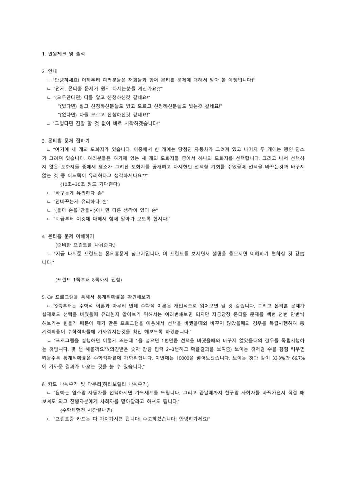

# 🎲 C#을 활용한 몬티홀 문제 증명  
> 수학 체험전 부스 운영 프로젝트 (2021.09.18)  
> 제2회 우송고 수학체험전 · 최종 **3위 수상**

---

## 🧑‍💻 제작자 및 팀 소개

| 이름 | 역할 |
|------|------|
| 김인성 | 부스 진행 및 프로그램 구현 |
| 박성훈, 김선찬, 홍민기 | 자료 제작, 진행 보조 |

---

## 📌 프로젝트 소개

**몬티홀 문제(Monty Hall Problem)**는 확률적 사고를 다루는 대표적인 퍼즐입니다.  
본 프로젝트는 수학 체험 부스를 통해 학생들이 이 문제를 **직접 체험하고, C# 프로그램을 통해 수학적으로 검증**할 수 있도록 기획되었습니다.

- **체험형 수학 부스 기획 & 운영**
- **몬티홀 문제 이론 + 실습 + 프로그래밍 시뮬레이션**
- **부스를 통한 통계 실험 결과 시각화**
- **C# 콘솔 응용 프로그램 제작**

---

## 🎯 핵심 구성 요소

### 1. 체험부스 홍보물 & 운영 기획서

| 체험 부스 홍보 포스터 | 운영 기획서 요약 |
|:---------------------:|:----------------:|
|  |  |

- 수학 체험전 공식 포스터 제작
- 이론, 운영 계획, 역할 분담 등이 정리된 기획서

---

### 2. 시뮬레이션 결과 (시행 횟수별)

| 시행 100회 | 시행 1000회 | 시행 10000회 |
|:----------:|:-----------:|:------------:|
|  |  |  |

- **선택을 바꿨을 때 평균 승률 약 66%**
- **선택을 유지했을 때 평균 승률 약 33%**
- 시행 횟수가 증가할수록 경험적 확률이 이론(통계)적 확률에 수렴함을 시각적으로 체험 가능

---

### 3. 몬티홀 참고지 (9컷 이미지)

|  |  |  |
|--------------------------|--------------------------|--------------------------|
|  |  |  |
|  |  |  |

- 실제 부스 체험 시 사용된 참고지 구성 요소

---

### 4. 운영 흐름 및 대본 요약

| 사용된 흐름도 대본 |      요약     |
|:---------------------:|:---------------:|
|  | 1. 인원 체크 및 입장  2. 몬티홀 문제 설명 및 예시 카드 나눠주기  3. 질문 유도: "선택을 바꾸는 것이 유리할까요?"  4. 이론 설명 + 조건부 확률 개념 도입  5. C# 프로그램을 통한 수치 검증  6. 최종 카드 나눠주기 & 정리

---

## 🛠 기술 스택

| 구분 | 기술 | 설명 |
|------|------|------|
| **언어** | C# | .NET 기반 콘솔 애플리케이션 제작 |
| **개발 환경** | Replit, Visual Studio | 시연 및 배포 용도 별도 |
| **실행 방식** | Windows `.exe` 응용 프로그램 | 무설치 실행 가능, 부스 현장에 적합 |
| **시뮬레이션 처리** | `Random` 클래스 기반 반복 시행 | 반복 횟수 지정 및 결과 자동 집계 |
| **시각화 방식** | Console 기반 출력 + 결과 요약 | 실시간 선택 결과, 바꿈/유지 성공률 출력 |

---

## 🧠 프로젝트 의의 및 활용

이 프로젝트는 단순한 **수학 퍼즐 설명**을 넘어,  
학생들이 실제로 **프로그래밍을 통해 수학 개념을 수치로 증명**하도록 설계되었습니다.

- **조건부 확률 개념을 이론 + 시뮬레이션 + 시각화**로 전달
- 단순히 정답을 암기하는 것이 아닌, **논리적으로 납득하고 체득하는 과정 중심 수업**
- **학생 참여형 체험 부스 운영**을 통해 수학적 흥미와 컴퓨팅 사고력 모두 향상
- 몬티홀 문제 외에도 **다양한 확률 기반 사고 실험**에 적용 가능한 교육 모델

> ✅ “수학 + 프로그래밍 + 체험”이라는 3박자를 활용한 융합적 프로젝트 사례입니다.
