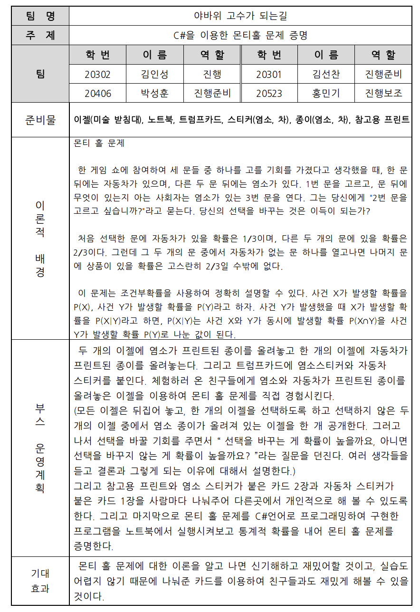
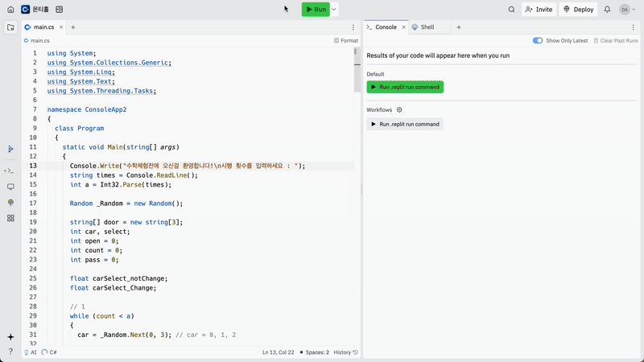
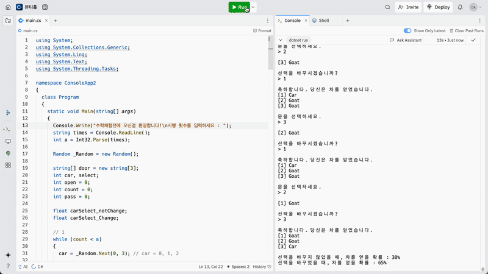
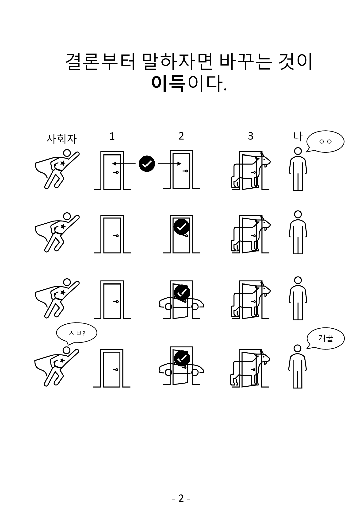
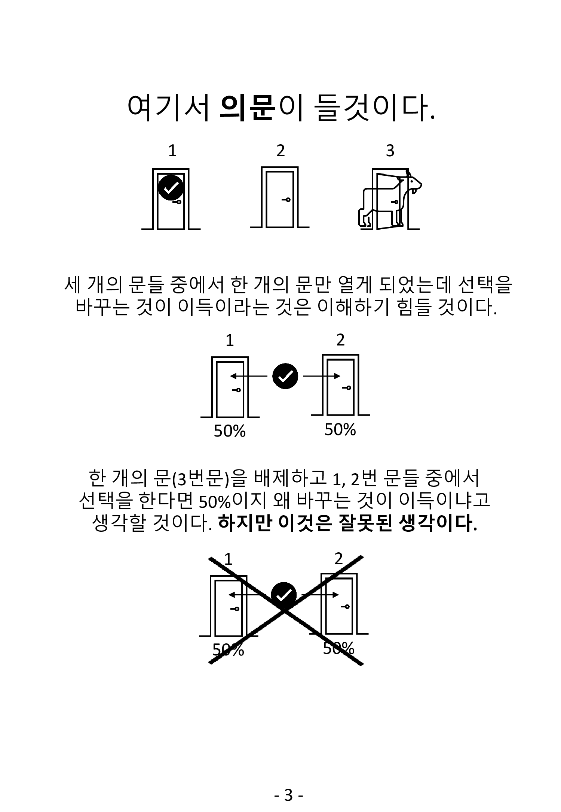
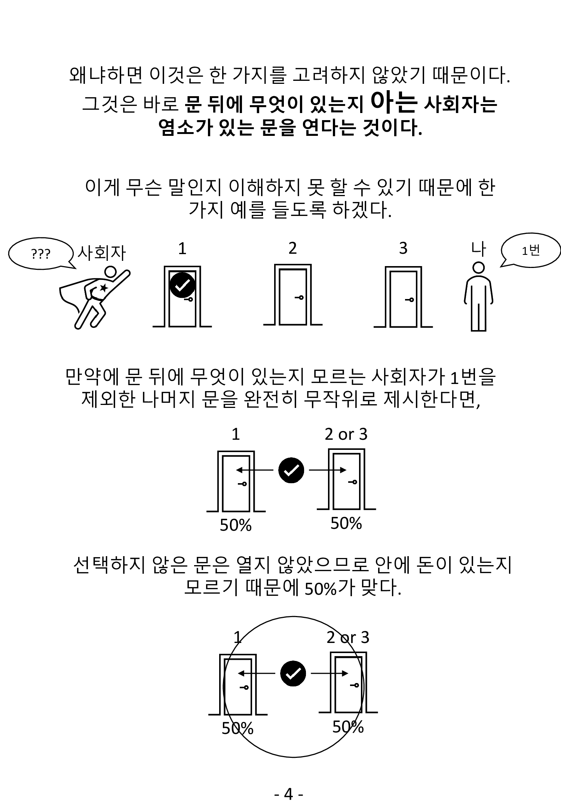
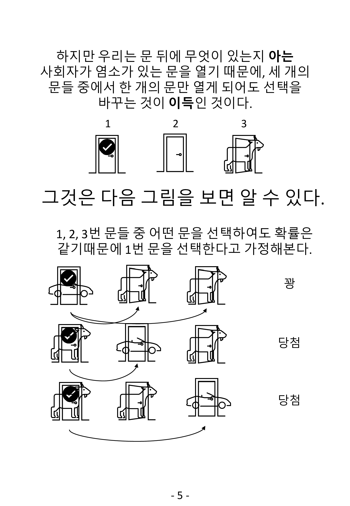
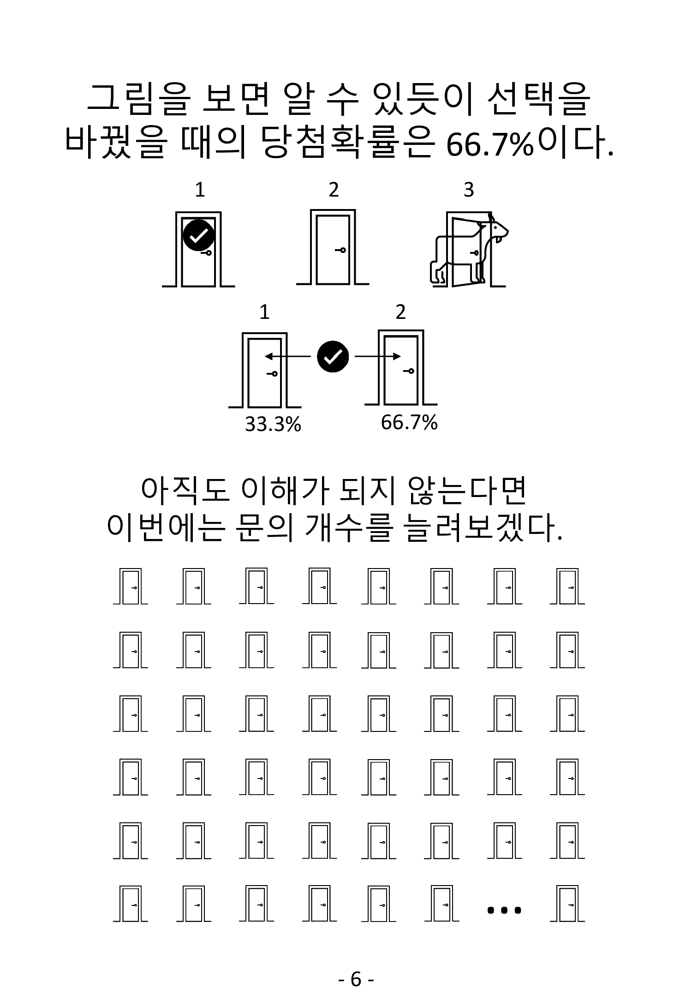
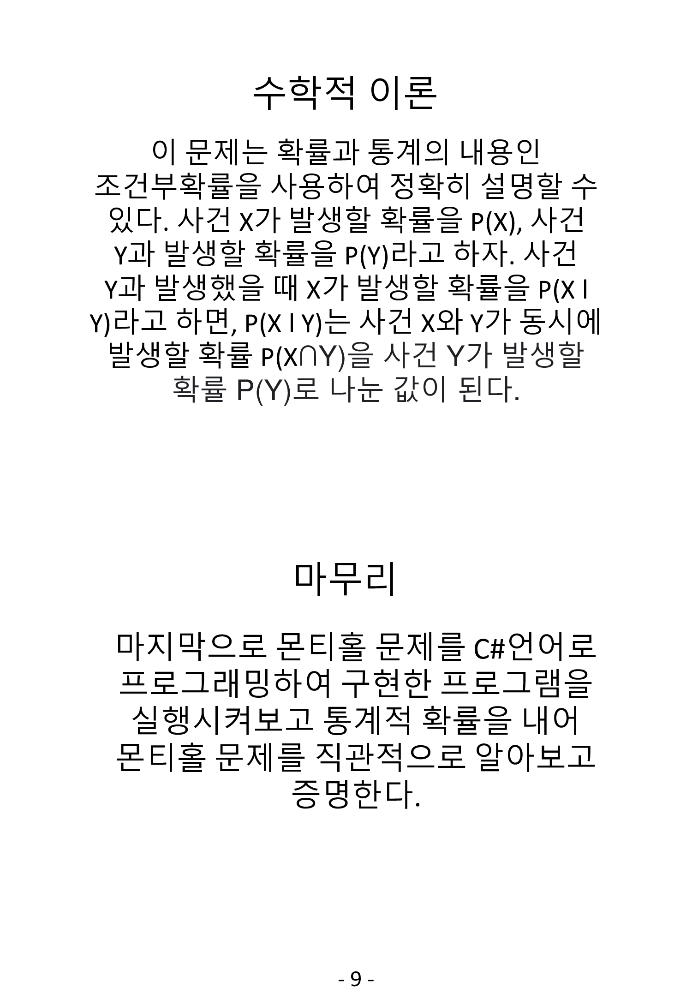

# 🎲 C#을 활용한 몬티홀 문제 증명  
> 수학 체험전 부스 운영 프로젝트 (2021.09.18)  
> 제2회 우송고 수학체험전 · 최종 **3위 수상**  
> Repository: [https://github.com/Danto7632/MontyHall](https://github.com/Danto7632/MontyHall)

---

## 🧑‍💻 제작자 및 팀 소개

| 이름 | 역할 |
|------|------|
| 김인성 | 부스 진행 및 프로그램 구현 |
| 박성훈, 김선찬, 홍민기 | 자료 제작, 진행 보조 |

---

## 📌 프로젝트 소개

**몬티홀 문제(Monty Hall Problem)**는 확률적 사고를 다루는 대표적인 퍼즐입니다.  
본 프로젝트는 수학 체험 부스를 통해 학생들이 이 문제를 **직접 체험하고, C# 프로그램을 통해 수학적으로 검증**할 수 있도록 기획되었습니다.

- **체험형 수학 부스 기획 & 운영**
- **몬티홀 문제 이론 + 실습 + 프로그래밍 시뮬레이션**
- **부스를 통한 통계 실험 결과 시각화**
- **C# 콘솔 응용 프로그램 제작**

---

## 🎯 핵심 구성 요소

### 1. 체험부스 홍보물 & 운영 기획서

| 체험 부스 홍보 포스터 | 운영 기획서 요약 |
|:---------------------:|:----------------:|
|  |  |

- 수학 체험전 공식 포스터 제작
- 이론, 운영 계획, 역할 분담 등이 정리된 기획서

---

### 2. 시뮬레이션 결과 (시행 횟수별)

| 시행 100회 | 시행 1000회 | 시행 10000회 |
|:----------:|:-----------:|:------------:|
|  |  |  |

- **선택을 바꿨을 때 평균 승률 약 66%**
- **선택을 유지했을 때 평균 승률 약 33%**
- 시행 횟수가 증가할수록 이론적 확률에 수렴함을 시각적으로 체험 가능

---

### 3. 체험 보드 예시 (9컷 이미지)

|  |  |  |
|--------------------------|--------------------------|--------------------------|
|  |  |  |
|  |  |  |

- 실제 부스 체험 시 사용된 보드 구성 요소
- 염소/자동차가 적힌 종이와 스티커를 활용한 실습 진행

---

### 4. 운영 흐름 및 대본 요약

> **진행 흐름**
1. 인원 체크 및 입장
2. 몬티홀 문제 설명 및 예시 카드 나눠주기
3. 질문 유도: "선택을 바꾸는 것이 유리할까요?"
4. 이론 설명 + 조건부 확률 개념 도입
5. C# 프로그램을 통한 수치 검증
6. 최종 카드 나눠주기 & 정리

> **대본 일부**

"여기 세 개의 문이 있습니다. 이중 한 개에는 자동차, 나머지 두 개에는 염소가 있습니다. 여러분은 이 중 하나를 선택합니다. 이후 염소가 있는 문 하나를 공개한 뒤, 선택을 바꾸시겠습니까? 바꾸지 않으시겠습니까?"

"그렇다면 지금부터 프로그램을 통해 1000번 실험한 결과를 보겠습니다."

---

## 🛠 기술 스택

| 언어 | 플랫폼 | 시각화 방식 |
|------|---------|-------------|
| C# | Windows (.exe 실행파일) | 콘솔 기반 결과 출력 + 통계 시각화 |

---

## 🏆 수상 이력

- **제2회 우송고 수학 체험전 - 3위 입상**
- 흥미 요소 + 확률 통계적 사고력을 결합한 수학 부스 운영으로 평가받음

---

## 🔍 참고 및 향후 계획

- 이후 `.pdf` 형태의 **학생 참고 학습자료**와 **이론 보드**도 첨부 예정
- C# 외 Python 기반 GUI 실험도 향후 도입 예정

---

> “이론을 직접 구현하고, 실험하며 확률을 체득하는 것”이 이 프로젝트의 핵심입니다.
